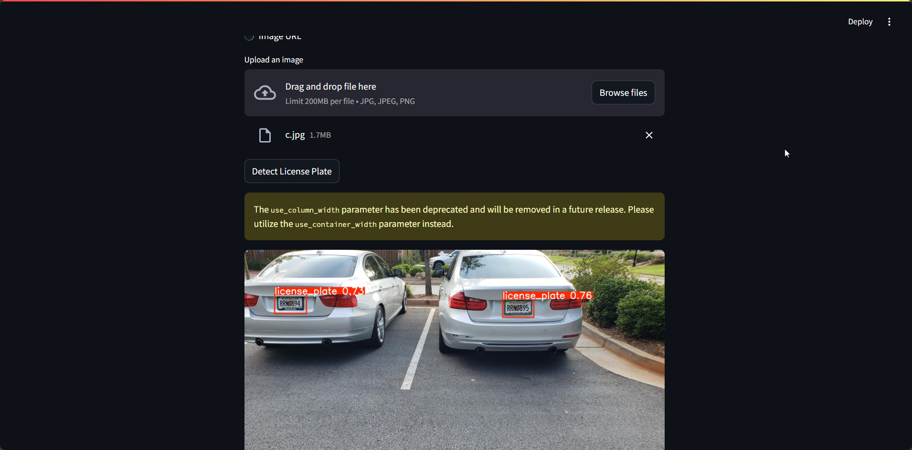

# license_plate_predicition — YOLOv8 License Plate Detection 📸🚀

A lightweight Streamlit app that loads a trained YOLOv8 model and detects license plates in images with an intuitive chat-style UI.

---

## Badges

[](./LICENSE)


---

## Table of Contents

- [Demo](#demo)
- [Features](#features)
- [Installation / Setup](#installation--setup)
- [Usage](#usage)
- [Configuration / Options](#configuration--options)
- [Contributing](#contributing)
- [License](#license)
- [Acknowledgements / Credits](#acknowledgements--credits)

---

## Demo

The repository includes real demo assets under `./demo/`.

- Screenshot: `./demo/demo.png`

  

- Video: `./demo/demo.mp4`

  <video src="./demo/demo.mp4" width="640" controls></video>

---

## Features

- **YOLOv8 inference** via `ultralytics` for license plate detection.
- **Chat-style Streamlit UI** to upload an image or paste an image URL.
- **On-image annotations** with bounding boxes.
- **Single-command launch** with Streamlit.

---

## Installation / Setup

Use a virtual environment for isolation.

```bash
# Create a virtual environment
python -m venv .venv

# Activate it
# On Linux/Mac:
source .venv/bin/activate
# On Windows:
.venv\Scripts\activate

# Upgrade pip (recommended)
pip install --upgrade pip

# Install dependencies
pip install -r requirements.txt
```

---

## Usage

- Make sure you have a YOLOv8 model file at `./models/model.pt` (see [Configuration](#configuration--options)).
- Launch the app:

```bash
streamlit run app.py
```

- In the app UI (`app.py` calling `render_chat_ui()` in `ui.py`):
  - Choose "Upload Image" and provide a `.jpg/.jpeg/.png`, or
  - Choose "Image URL" and paste a direct image URL.
  - Click "Detect License Plate" to run inference. The result image with bounding boxes will be displayed.

Programmatic highlights:

- Model loading: `utils.load_model()` uses `ultralytics.YOLO` and Streamlit caching.
- Inference: `utils.detect_license_plate()` runs `model.predict()` and returns an annotated image.

---

## Configuration / Options

- **Model path**: `app.py` loads `./models/model.pt` once at startup.
  - Replace this file with your trained YOLOv8 weights.
  - You can retrain with Ultralytics and export to `.pt`.
- **Confidence threshold**: Set in `utils.detect_license_plate()` (default `conf=0.25`). Adjust as needed.
- **Image inputs**:
  - Upload via Streamlit file uploader.
  - Provide a URL; the app fetches it using `requests` and decodes with OpenCV.

---

## Contributing

Contributions are welcome! Please:

1. Fork the repo.
2. Create a feature branch.
3. Commit changes with clear messages.
4. Open a pull request describing the motivation and changes.

For larger changes, consider opening an issue first to discuss the proposal.

---

## License

This project is licensed under the MIT License. See [`LICENSE`](./LICENSE) for details.

---

## Acknowledgements / Credits

- [`ultralytics`](https://github.com/ultralytics/ultralytics) — YOLOv8 model and inference utilities.
- [`streamlit`](https://streamlit.io) — simple web app framework for ML demos.
- [`opencv-python`](https://pypi.org/project/opencv-python/), [`numpy`](https://numpy.org/), and [`Pillow`](https://python-pillow.org/) for image handling and visualization.
